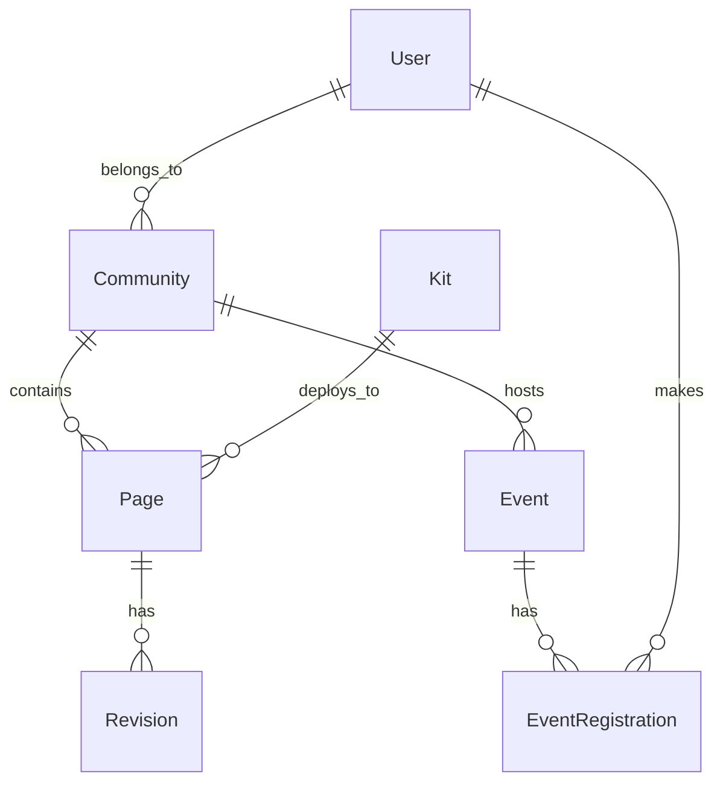

# Project Structure and Documentation

## Directory Tree

```
├── README.md
├── main.py
├── package-lock.json
├── package.json
├── recovery_capital_prompt.json
├── rejection_simulation_prompt.json
├── resource-finder.js
├── resource_finder_prompt.json
├── server.js
├── static/
│   └── [1 image files]
│   ├── css/
│   ├── video/
├── system_prompt.json
├── templates/
│   ├── base.html
│   ├── index.html
│   ├── legal.html
│   ├── recovery_capital.html
│   ├── rejection_simulation.html
│   ├── resource_finder.html
│   ├── toxicity_assessment.html
├── test.py
├── toxicity_assessment_prompt.json
├── tree.md
├── treehouse.py
├── uploads/
```

## Database Models and Relationships



## Configuration Map

```yaml
Environment:
  - FLASK_ENV
  - SECRET_KEY
  - DATABASE_URL

Auth0:
  - AUTH0_DOMAIN
  - AUTH0_CLIENT_ID
  - AUTH0_CLIENT_SECRET
  - AUTH0_MGMT_API_CLIENT_ID
  - AUTH0_MGMT_API_SECRET
  - AUTH0_MGMT_API_AUDIENCE

Stripe:
  - STRIPE_SECRET_KEY
  - STRIPE_WEBHOOK_SECRET

Email:
  - MAILGUN_API_KEY
  - MAILGUN_DOMAIN
  - MAILGUN_BASE_URL_TEST
  - MAILGUN_BASE_URL_LIVE

Social:
  - DEFAULT_SOCIAL_TITLE
  - DEFAULT_SOCIAL_DESCRIPTION

```

## Project Configuration (pyproject.toml)

```toml
[tool.poetry]
name = "all-one-thing"
version = "0.1.0"
description = "Flask application managing multi-community content with test/live environments"

[tool.poetry.dependencies]
python = '^3.9'
flask = '^2.0.0'
sqlalchemy = '^1.4.0'
alembic = '^1.7.0'
python-dotenv = '^0.19.0'
authlib = '^0.15.0'
stripe = '^2.60.0'
requests = '^2.26.0'

[tool.poetry.dev-dependencies]
pytest = '^6.2.0'
black = '^21.5b2'
flake8 = '^3.9.0'
mypy = '^0.910'

[build-system]
requires = ["poetry-core>=1.0.0"]
build-backend = "poetry.core.masonry.api"
```