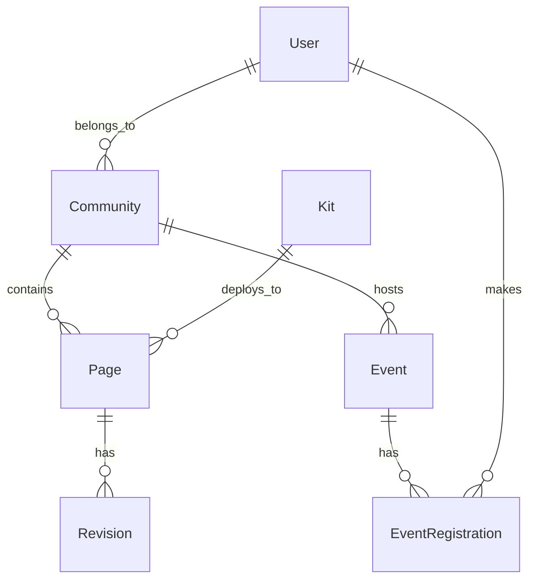

# Project Structure and Documentation

## Directory Tree

```
├── README.md
├── abbot.py
├── app.py
├── chat.py
├── chatgptdocs.md
├── database.py
├── database_manager.py
├── design_plan.md
├── document_processor.py
├── extensions.py
├── fema.py
├── filters.py
├── main.py
├── migrations/
│   ├── env.py
│   ├── versions/
│   │   ├── 974c2c48d4de_add_file_path_to_document_model.py
│   │   ├── f2ad1fb7dd31_initial_migration.py
├── models.py
├── package-lock.json
├── package.json
├── profile.py
├── prompt_abbot.json
├── prompts.json
├── rejection.py
├── resource_finder.py
├── static/
│   └── [1 image files]
│   ├── css/
│   │   ├── custom.css
│   │   ├── dist.css
│   │   ├── main.css
│   ├── js/
│   │   ├── chat.js
│   │   ├── fema-workflow.js
│   │   ├── insurance-upload.js
│   │   ├── insurance-workflow.js
│   │   ├── main.js
│   │   ├── navigation.js
│   ├── video/
├── templates/
│   ├── _footer.html
│   ├── _nav.html
│   ├── abbot/
│   │   ├── chat.html
│   ├── base.html
│   ├── chat/
│   │   ├── chat.html
│   │   ├── dashboard.html
│   │   ├── detail.html
│   │   ├── first_time_user.html
│   │   ├── list.html
│   ├── checklists.html
│   ├── dashboard.html
│   ├── documents/
│   │   ├── list.html
│   │   ├── view.html
│   ├── documents.html
│   ├── fema/
│   │   ├── base_fema.html
│   │   ├── step1_requirements.html
│   │   ├── step2_form.html
│   │   ├── step3_analysis.html
│   │   ├── wizard.html
│   ├── index.html
│   ├── insurance/
│   │   ├── base_insurance.html
│   │   ├── start.html
│   │   ├── step1_requirements.html
│   │   ├── step2_claim.html
│   │   ├── step3_analysis.html
│   │   ├── wizard.html
│   ├── profile/
│   │   ├── reports.html
│   │   ├── view.html
│   ├── rejection/
│   │   ├── wizard.html
│   ├── resources/
│   │   ├── chat.html
│   ├── video_player.html
├── tree.md
├── treehouse.py
├── uploads/
```

## Database Models and Relationships



## Configuration Map

```yaml
Environment:
  - FLASK_ENV
  - SECRET_KEY
  - DATABASE_URL

Auth0:
  - AUTH0_DOMAIN
  - AUTH0_CLIENT_ID
  - AUTH0_CLIENT_SECRET
  - AUTH0_MGMT_API_CLIENT_ID
  - AUTH0_MGMT_API_SECRET
  - AUTH0_MGMT_API_AUDIENCE

Stripe:
  - STRIPE_SECRET_KEY
  - STRIPE_WEBHOOK_SECRET

Email:
  - MAILGUN_API_KEY
  - MAILGUN_DOMAIN
  - MAILGUN_BASE_URL_TEST
  - MAILGUN_BASE_URL_LIVE

Social:
  - DEFAULT_SOCIAL_TITLE
  - DEFAULT_SOCIAL_DESCRIPTION

```

## Project Configuration (pyproject.toml)

```toml
[tool.poetry]
name = "all-one-thing"
version = "0.1.0"
description = "Flask application managing multi-community content with test/live environments"

[tool.poetry.dependencies]
python = '^3.9'
flask = '^2.0.0'
sqlalchemy = '^1.4.0'
alembic = '^1.7.0'
python-dotenv = '^0.19.0'
authlib = '^0.15.0'
stripe = '^2.60.0'
requests = '^2.26.0'

[tool.poetry.dev-dependencies]
pytest = '^6.2.0'
black = '^21.5b2'
flake8 = '^3.9.0'
mypy = '^0.910'

[build-system]
requires = ["poetry-core>=1.0.0"]
build-backend = "poetry.core.masonry.api"
```